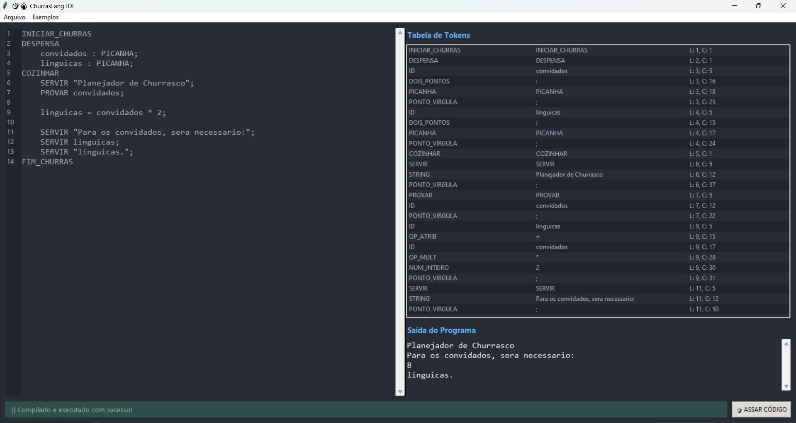

# 🥩🔥 Compilador ChurrasLang

Compilador para uma linguagem de programação simplificada chamada **ChurrasLang**, desenvolvido como projeto final para a disciplina de Compiladores. O projeto inclui um analisador léxico, um analisador sintático descendente recursivo e uma IDE completa construída com Tkinter.

## ✨ Funcionalidades

- **Linguagem Temática:** Sintaxe inspirada num churrasco (`PICANHA`, `ARROZ`, `SERVIR`, `PROVAR`).
- **Analisador Léxico:** Construído com base em Autômatos Finitos, sem o uso de expressões regulares.
- **Analisador Sintático:** Implementa o método descendente recursivo e suporta:
  - As 4 operações aritméticas (`+`, `-`, `*`, `/`).
  - Precedência de operadores com uso de parênteses `()`.
  - Tipos de dados `inteiro` (`PICANHA`) e `real` (`ARROZ`).
  - Suporte a `Strings` literais.
- **IDE Completa:** Uma interface gráfica com:
  - Editor com numeração de linhas.
  - Tabela de tokens detalhada.
  - Saída do programa.
  - Highlight de erro no código.
  - Entrada de dados interativa com o comando `PROVAR`.

## 🚀 Como Executar

1.  Certifique-se de ter o Python 3 instalado.
2.  Clone este repositório.
3.  Navegue até a pasta do projeto e execute a interface gráfica:
    ```bash
    python gui.py
    ```
4.  Para a versão de terminal:
    ```bash
    python main.py
    ```

## 📸 Screenshot



## 📝 Exemplo de Código
INICIAR_CHURRAS
    DESPENSA
       convidados : PICANHA;
       custo_por_pessoa : ARROZ;
    COZINHAR
       SERVIR "Calculadora de Custo do Churrasco";
       SERVIR "Digite o numero de convidados:";
       PROVAR convidados;

       custo_por_pessoa = 750.50 / convidados;

       SERVIR "O custo por pessoa sera de:";
       SERVIR custo_por_pessoa;
FIM_CHURRASa